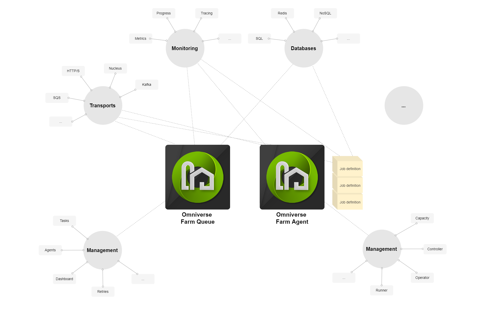

# Architecture

As a platform for distributed task scheduling and execution, Farm embraces a microservice architecture to seamlessly scale workflows.

## Motivations

The main motivations for building workflows as microservices are that they:

- Promote component reuse, leading to smaller code footprint.

- Promote loose coupling between components, facilitating integration and evolution of systems.

- Promote collaboration between components, as deploying a new one has limited impact on others.

By moving away from large, monolithic, opaque systems, services offer a more flexible approach to combining and chaining together tasks in order to build larger workflows.

## Components

The design of the Farm Queue and Farm Agent (and even the tasks they execute) are as a collection of services implementing common functionality. Features common to all components include:

- Reusing the same logging system, in order to have uniform logs across the system.

- Reusing the same metrics collection, in order to instrument end-to-end performance.

- Reusing the same data transports, in order for components to support common communication protocols.

- etc.

While we may refer to Farm Queue and Farm Agent as distinct entities, their roles rather than their design are what differentiate them.

At a high level, Farm Queue maintains a list of tasks to be executed, which Agents equipped with various capabilities visit in order to query for work to be done.

The component architecture of Farm can be illustrated as a constellation of shared features (note that a number of services have been voluntarily omitted for clarity):

<figure>

<figcaption>
Farm component architecture
</figcaption>
</figure>

  Purpose      Domain       Description
  ------------ ------------ --------------------------------------------------------------------------------
  Agent        Farm Queue   Maintains list of connected Farm Agents
  Dashboard    Farm Queue   The Farm Queue user dashboard
  Jobs         Farm Queue   Stores job definitions
  Logs         Farm Queue   Stores task execution logs
  Retries      Farm Queue   Initiates and tracks retried tasks
  Settings     Farm Queue   Tracks settings for the Farm instance
  Tasks        Farm Queue   Manages submitted tasks
  Controller   Farm Agent   Controls tasks execution on Farm Agent worker nodes
  Capacity     Farm Agent   Tracks available capacity on Farm Agent worker nodes against task requirements

  : Farm's primary service components
